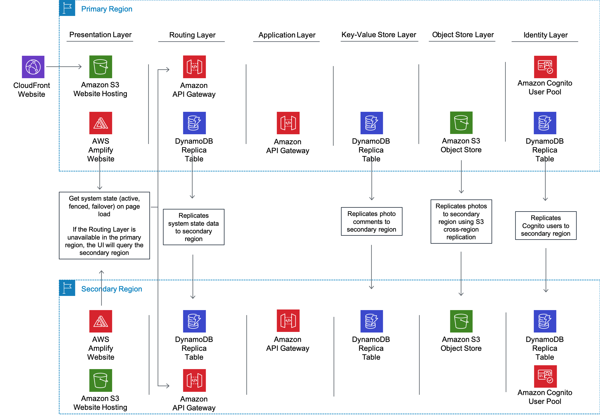

# Multi Region Application Architecture

The Multi Region Application Architecture Solution deploys a N-Tier application into two AWS regions. The Primary region is the one where the CloudFormation Stack is created. The Secondary region is specified as a parameter to the CloudFormation Template. A Sample photo sharing application is included in the solution to exercise the underlying multi-region layers which leverages Cognito User Pools for User Authentication and Authorization, S3 for Photo Storage, and DynamoDB for Photo Comments Storage.

## On this Page
- [Architecture Overview](#architecture-overview)
- [Layers Overview](#layers-overview)
- [Creating a custom build](#creating-a-custom-build)
- [License](#license)

## Architecture Overview


## Layers Overview
The N-Tier application is composed of many underlying layers, each of which is its own CloudFormation template. 
* The **Presentation Layer** consistently deploys a sample Photo Sharing website independently to both regions. The website is built using React and Amplify, and is hosted in a S3 bucket configured for static website hosting and distributed via CloudFront.
* The **Application Layer** consistently deploys a sample Photo Sharing backend-API independently to both regions. The backend is built using Amazon API Gateway, with DynamoDB Proxy Integration to store and retrieve comments made on photos.
* The **Key-Value Store Layer** uses a CloudFormation Custom Resource to deploy a DynamoDB Global Table in both regions.
* The **Object Store Layer** uses a CloudFormation Custom Resource to deploy S3 buckets in primary and secondary regions, and set up Cross-Region Replication between them.
* The **Identity Layer** uses a new AWS Solution built to backup and replicate Cognito User Pools from a primary region to a secondary region
* Finally, the **Application Architecture** template combines the aforementioned layers into a top-level CloudFormation that simplifies deployment of the solution.

## Creating a custom build
The solution can be deployed through the CloudFormation template available on the solution home page.
To make changes to the solution, download or clone this repo, update the source code and then run the deployment/build-s3-dist.sh script to deploy the updated Lambda code to an Amazon S3 bucket in your account.

### Prerequisites:
* [AWS Command Line Interface](https://aws.amazon.com/cli/)
* Node.js 10.x or later

### 1. Running unit tests for customization
Run unit tests to make sure added customization passes the tests:
```
cd ./deployment
chmod +x ./run-unit-tests.sh
./run-unit-tests.sh
```

### 2. Create an Amazon S3 Bucket
The CloudFormation template is configured to pull the Lambda deployment packages from Amazon S3 bucket in the region the template is being launched in. Create a bucket in the desired region with the region name appended to the name of the bucket. eg: for us-east-1 create a bucket named: `my-bucket-us-east-1`
```
aws s3 mb s3://my-bucket-us-east-1
```

### 3. Create the deployment packages
Build the distributable:
```
chmod +x ./build-s3-dist.sh
./build-s3-dist.sh my-bucket multi-region-application-architecture my-version
```

> **Notes**: The _build-s3-dist_ script expects the bucket name as one of its parameters, and this value should not include the region suffix

Deploy the distributable to the Amazon S3 bucket in your account:
```
aws s3 sync ./regional-s3-assets/ s3://my-bucket-us-east-1/multi-region-application-architecture/my-version/ 
aws s3 sync ./global-s3-assets/ s3://my-bucket-us-east-1/multi-region-application-architecture/my-version/ 
```

### 4. Launch the CloudFormation template.
* Get the link of the multi-region-application-architecture.template uploaded to your Amazon S3 bucket.
* Deploy the Multi Region Application Architecture Solution to your account by launching a new AWS CloudFormation stack using the S3 link of the multi-region-application-architecture.template.

## License

* This project is licensed under the terms of the Apache 2.0 license. See `LICENSE`.
* Included AWS Lambda functions are licensed under the MIT-0 license. See `LICENSE.MIT-0`.
